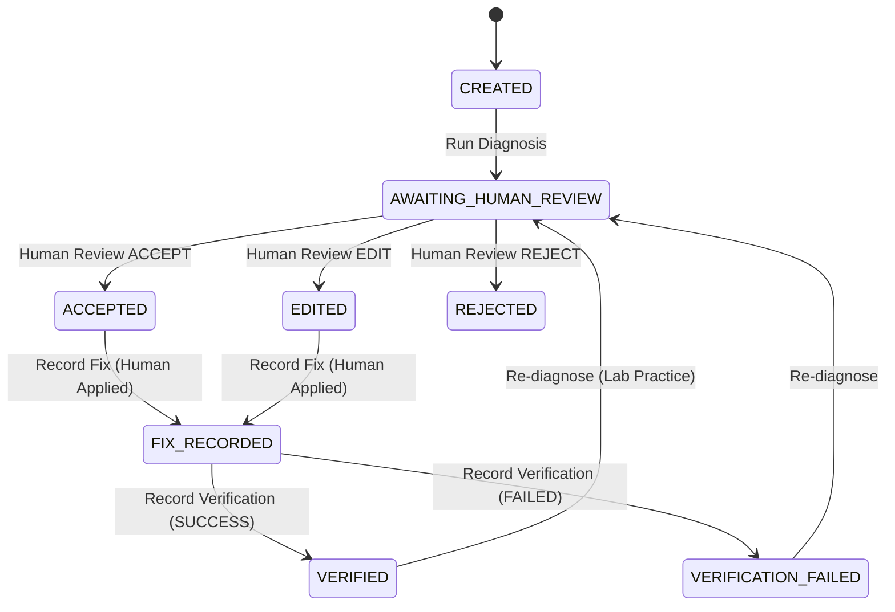

# NetSage AI — Production Backend

AI-assisted Cisco network troubleshooting system combining deterministic Cisco rule checks with multi-provider LLM diagnosis, multi-signal evidence grounding, mandatory human-in-the-loop review, and immutable audit trailing.

> **CRITICAL SAFETY PRINCIPLE**: NetSage AI is an advisory platform. The backend **NEVER** autonomously executes Cisco commands on devices. All remediation commands are recorded for audit purposes only and must be applied and verified by authorized human engineers.

---

## Key Capabilities

- **35 Seeded Realistic Cisco Cases**: Covering VLANs, Trunks, Static Routing, Inter-VLAN Routing, DHCP, DNS, ACLs, NAT, and Interface status.
- **Deterministic Python Rule Engine**: 11 domain rules validating show outputs, topology, subnets, gateways, and configurations without hallucinations.
- **Multi-Provider AI Layer**: Seamless support for `mock` (deterministic local tests), `openai` (GPT-4o), `gemini` (Gemini 1.5 Flash), and `anthropic` (Claude 3.5 Sonnet) with automatic tenacity exponential backoff retries and timeouts.
- **Adversarial Prompt Injection Boundary**: All user show commands and topology data are framed strictly as untrusted evidence blocks.
- **Deterministic Evidence Grounding**: Validates AI root causes against actual IP addresses, interfaces, VLANs, subnets, and technical status tokens.
- **Mandatory Human Review**: State machine requires explicit human decision (`ACCEPTED`, `EDITED`, `REJECTED`) before any case can be closed.
- **Evidence & Audit Trail APIs**: Full queryable endpoints for raw & parsed evidence (`/evidence`) and chronological audit logging (`/audit-trail`).
- **Alembic Database Migrations**: Enterprise-grade schema management with versioned migrations.
- **Security & Reliability**: Request body size limits (HTTP 413), execution timing middleware, recursive secret redaction, and optional API-key authentication.
- **122 Automated Tests**: Comprehensive unit, integration, and security test suite passing with 0 failures and 0 warnings.

---

## Quick Start (Local Development)

### 1. Setup Environment
```bash
cd backend
python -m venv venv

# Windows:
venv\Scripts\activate
# Linux / macOS:
source venv/bin/activate

pip install -r requirements.txt
```

### 2. Configure Environment
```bash
# Windows:
copy .env.example .env
# Linux / macOS:
cp .env.example .env
```
*(Default settings use `AI_PROVIDER=mock` and SQLite, working out of the box with zero external keys)*

### 3. Run Database Migrations & Seed Cases
```bash
# Apply schema via Alembic:
alembic upgrade head

# Seed 35 realistic Cisco troubleshooting cases:
python scripts/seed_database.py
```

### 4. Start the Application Server
```bash
uvicorn app.main:app --reload --host 0.0.0.0 --port 8000
```
- **Interactive OpenAPI Documentation**: [http://localhost:8000/docs](http://localhost:8000/docs)
- **ReDoc Documentation**: [http://localhost:8000/redoc](http://localhost:8000/redoc)
- **Health Check**: [http://localhost:8000/health](http://localhost:8000/health)
- **Readiness Check**: [http://localhost:8000/ready](http://localhost:8000/ready)

---

## API Endpoints Reference

All API routes are served under `/api/v1/`:

### Cases & Evidence
| Method | Endpoint | Description |
|---|---|---|
| `GET` | `/api/v1/cases` | List cases with search, category, severity, and pagination |
| `POST` | `/api/v1/cases` | Create a new troubleshooting case |
| `GET` | `/api/v1/cases/{case_id}` | Get full case details |
| `PUT` | `/api/v1/cases/{case_id}` | Update case parameters |
| `DELETE` | `/api/v1/cases/{case_id}` | Delete a case |
| `GET` | `/api/v1/cases/{case_id}/evidence` | Get raw and parsed show-command evidence |

### Diagnosis & Rules
| Method | Endpoint | Description |
|---|---|---|
| `POST` | `/api/v1/cases/{case_id}/diagnose` | Run AI + Rule diagnosis pipeline |
| `GET` | `/api/v1/cases/{case_id}/diagnoses` | Get historical diagnoses for a case |
| `GET` | `/api/v1/diagnoses/{diagnosis_id}` | Get a single diagnosis record |
| `POST` | `/api/v1/rules/run` | Execute deterministic rules directly against context |
| `GET` | `/api/v1/rules` | List all available deterministic rules |

### Human Review & Fix Workflow
| Method | Endpoint | Description |
|---|---|---|
| `POST` | `/api/v1/cases/{case_id}/review` | Submit human review (`ACCEPTED`, `EDITED`, `REJECTED`) |
| `GET` | `/api/v1/cases/{case_id}/reviews` | List review decisions for a case |
| `GET` | `/api/v1/reviews/{review_id}` | Get review by ID |
| `POST` | `/api/v1/cases/{case_id}/fix` | Record human-applied fix (never auto-executed) |
| `POST` | `/api/v1/cases/{case_id}/verify` | Record post-fix verification (`SUCCESS`, `FAILED`) |
| `GET` | `/api/v1/cases/{case_id}/verifications` | List verification records |

### Audit & Analytics
| Method | Endpoint | Description |
|---|---|---|
| `GET` | `/api/v1/cases/{case_id}/audit-trail` | Chronological immutable lifecycle audit trail |
| `GET` | `/api/v1/dashboard/summary` | Global KPIs (Cases, Diagnoses, Reviews, Agreement) |
| `GET` | `/api/v1/dashboard/categories` | Breakdown by network category |
| `GET` | `/api/v1/dashboard/severities` | Breakdown by severity level |
| `GET` | `/api/v1/dashboard/timeline` | Daily activity timeline |
| `GET` | `/api/v1/responsible-ai/summary` | RAI metrics (Correction rate, Grounding warnings) |
| `GET` | `/api/v1/responsible-ai/corrections` | Cases where human engineers edited AI findings |
| `POST` | `/api/v1/evaluation/run` | Run internal benchmark evaluation against ground truth |
| `GET` | `/api/v1/evaluation/summary` | Get latest evaluation metrics summary |

---

## State Machine Lifecycle



---

## Running Automated Tests & Coverage

```bash
# Run complete test suite (122 tests):
pytest -v

# Run with test coverage:
pytest --cov=app --cov-report=term-missing
```

---

## Docker Deployment

```bash
# Build and run with Docker Compose:
docker-compose up --build -d

# Check service logs:
docker-compose logs -f backend
```
